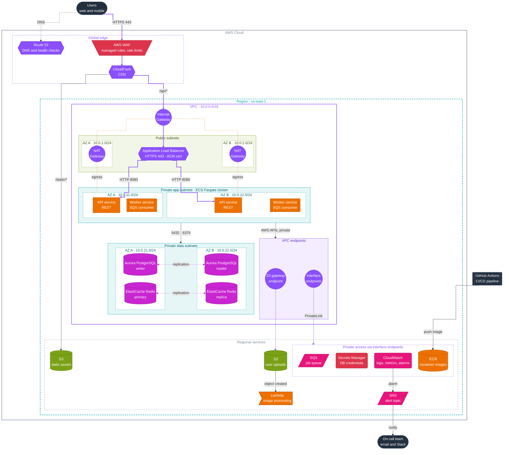
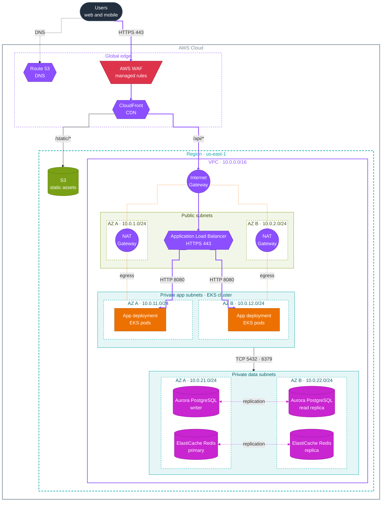

# aws webapp architecture diagram



# example 2




## Mermaid testing 2

```mermaid
%%{init: {"fontFamily": "Helvetica, Arial, sans-serif", "flowchart": {"curve": "step", "nodeSpacing": 40, "rankSpacing": 50, "padding": 14}}}%%
flowchart TB
    user@{ shape: person, label: "User" }
    dev@{ shape: person, label: "Developer" }
    web@{ shape: browser, label: "Web app<br/>React SPA" }
    internet@{ shape: cloud, label: "Internet" }
    repo@{ shape: folder, label: "CDK app<br/>infrastructure as code" }
    ci@{ shape: console, label: "GitHub Actions<br/>cdk deploy" }

    subgraph aws["AWS Cloud · us-east-1"]
        cdn{{"CloudFront<br/>CDN + WAF"}}
        site@{ shape: bucket, label: "S3 site<br/>static files" }

        subgraph api["API"]
            apigw{{"API Gateway<br/>HTTP API"}}
            cognito("Cognito<br/>user pool")
            fnApi>"Lambda<br/>API handlers"]
        end

        subgraph processing["Image processing"]
            uploads@{ shape: bucket, label: "S3 uploads<br/>original photos" }
            queue@{ shape: h-cyl, label: "SQS<br/>resize jobs" }
            fnResize>"Lambda<br/>thumbnailer"]
            thumbs@{ shape: bucket, label: "S3 thumbnails" }
        end

        ddb@{ shape: datastore, label: "DynamoDB<br/>photo metadata" }
    end

    user --> web
    web ==>|HTTPS 443| internet
    internet ==> cdn
    cdn -->|/*| site
    cdn -->|/img/*| thumbs
    cdn ==>|/api/*| apigw
    apigw ==>|invoke| fnApi
    apigw -.->|verify JWT| cognito
    fnApi -->|presigned URL| uploads
    fnApi -->|read and write| ddb
    web -->|PUT with presigned URL| uploads
    uploads -->|object created| queue
    queue -->|batch| fnResize
    fnResize -->|write| thumbs
    fnResize -->|update status| ddb
    dev --> repo
    repo -->|git push| ci
    ci -->|deploy| aws

    classDef ext fill:#232F3E,stroke:#5A6B7F,color:#fff
    classDef net fill:#8C4FFF,stroke:#6A3BC2,color:#fff
    classDef sec fill:#DD344C,stroke:#A8233A,color:#fff
    classDef compute fill:#ED7100,stroke:#B35500,color:#fff
    classDef db fill:#C925D1,stroke:#951B9B,color:#fff
    classDef storage fill:#7AA116,stroke:#5B7A10,color:#fff
    classDef integration fill:#E7157B,stroke:#B0105D,color:#fff
    class user,dev,web,internet,repo,ci ext
    class cdn,apigw net
    class cognito sec
    class fnApi,fnResize compute
    class ddb db
    class site,thumbs,uploads storage
    class queue integration

    style aws fill:none,stroke:#7D8998,stroke-width:2px,color:#7D8998
    style api fill:none,stroke:#8C4FFF,stroke-dasharray:4 3,color:#8C4FFF
    style processing fill:none,stroke:#ED7100,stroke-dasharray:4 3,color:#ED7100

    %% Edge colors (indexes from check_diagram.py): purple = request path,
    %% green = direct upload, which bypasses the API
    linkStyle 1,2,5,6 stroke:#8C4FFF,stroke-width:2.5px
    linkStyle 10 stroke:#7AA116,stroke-width:2px
```
